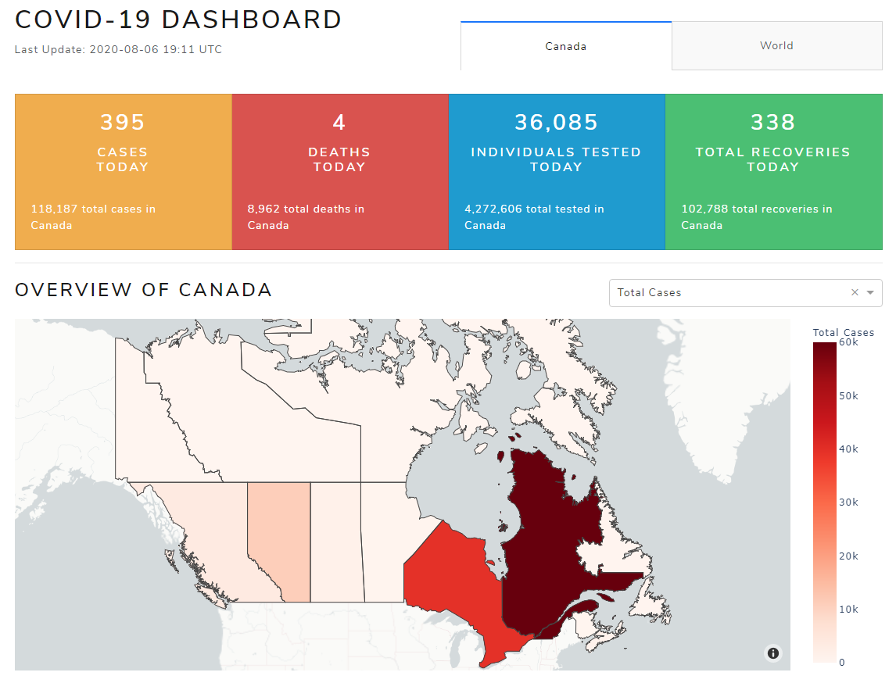

# covid19-dashboard
An interactive dashboard app tracking COVID-19 statistics for Canada and the world. 
The dashboard interfaces with a NoSQL cloud database (MongoDB Atlas) and checks daily for data updates.

 
Built using Plotly's Dash in Python.
Currently hosted at: [https://covid19status-dashboard.herokuapp.com](https://covid19status-dashboard.herokuapp.com)

------
##### Data Sources
- [Government of Canada, Public Health Infobase](https://health-infobase.canada.ca/)
- [Our World in Data](https://ourworldindata.org/coronavirus)